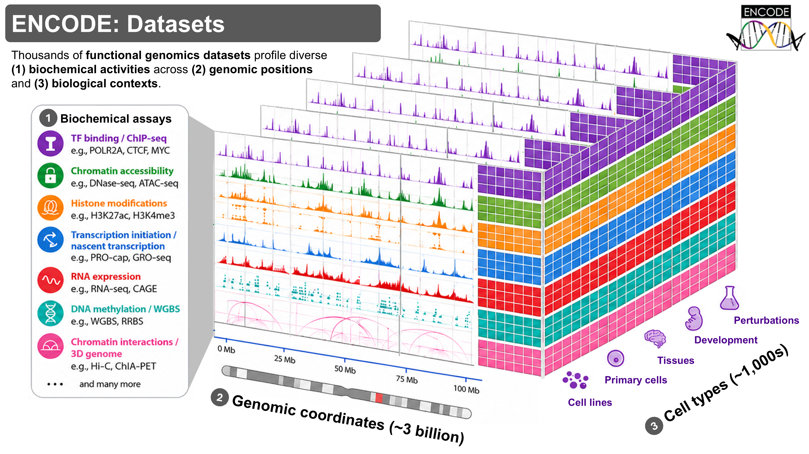
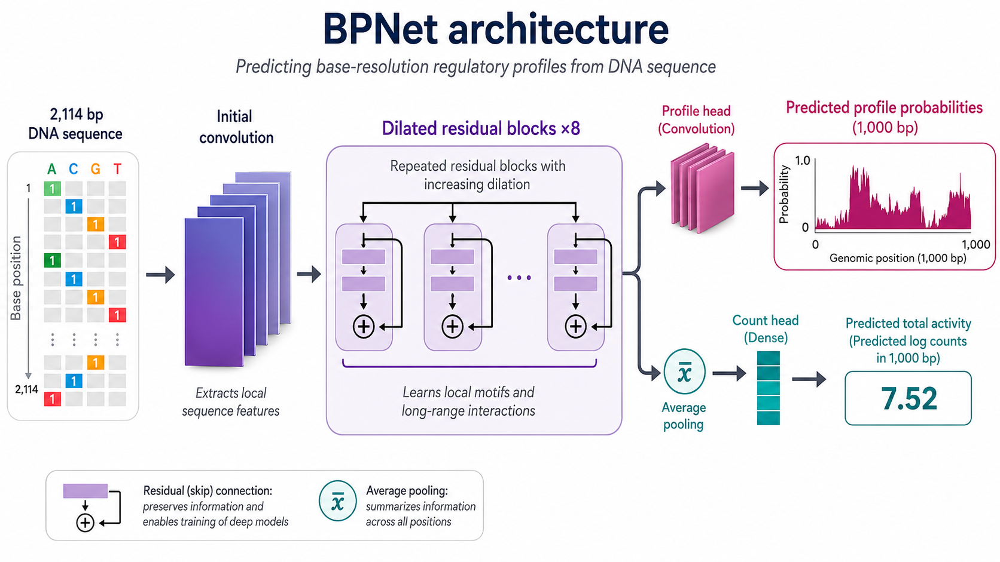
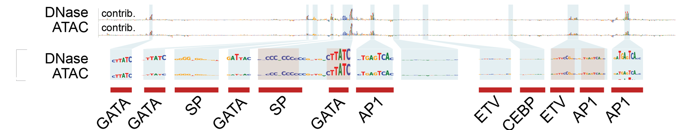
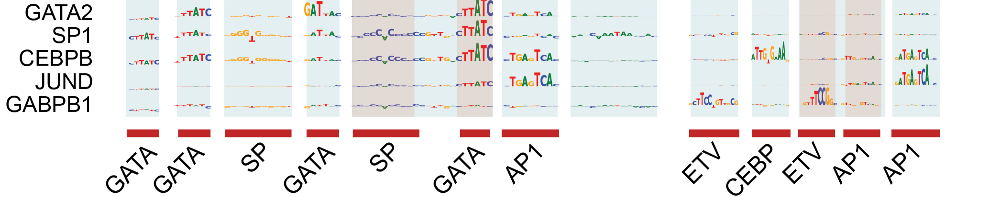


Over two decades, the Encyclopedia of DNA Elements (ENCODE) Consortium has used diverse functional genomics experiments to map millions of regions in the human and mouse genomes that help control when, where, and how strongly genes are turned on. These maps characterize the biochemical properties and activity of regulatory DNA across thousands of cell types and tissues. However, they do not fully explain how this activity is encoded in the DNA sequence itself: which individual DNA letters are important, how combinations and arrangements of letters cause a region to behave differently across cell types, or how a genetic variant might alter its activity.

To help answer these questions, we developed a family of deep learning models that use DNA sequences as inputs to predict associated genome-wide biochemical activity measured by diverse experiments. We also developed a framework of model interpretation methods, allowing us to identify the sequence features and regulatory rules that drive model predictions. 

Today, we release **GRAMMAR** (Genomic Regulatory Atlas of sequence Models, Motifs, Annotations and Rules), a collection of 3,865 experiment-specific model sets across the ENCODE data compendium spanning several layers of gene regulation, including the binding of regulatory proteins to DNA, chromatin accessibility, transcription initiation, and regulatory activity measured using high-throughput reporter assays. For each experiment, we also release model-predicted, de-noised biochemical activity profiles at single-base resolution; model-estimated contributions of individual DNA bases to the activity of each regulatory element in each cellular context; recurring predictive DNA patterns (motifs) learned by the models; the genomic locations of predictive motif instances; and genome-browser tracks that make these outputs easy to explore.

Together, these resources transform thousands of ENCODE experiments into a reusable and interpretable atlas of the cell-context-specific DNA sequence rules that shape gene regulation. In this first post of a broader series, we introduce the ENCODE GRAMMAR resource and show how predictions and sequence annotations derived from multiple models can be integrated to decode the sequence basis of regulatory element activity.

**Contributions**: _(Author order does not represent relative contribution)_
- Vivekanandan Ramalingam: BPNet model optimization and training, data uploads, general analysis
- Chang M. Yun: ChromBPNet model training, MotifCompendium analysis
- Vivian Hecht: ChromBPNet model training, model resource uploads, project management
- Aman Patel: Model resource uploads
- Anusri Pampari: ChromBPNet model development, ChromBPNet model training, data uploads
- Ziwei Chen: ReporterNet model development, ReporterNet model training, ChromBPNet model training
- Kelly Cochran: ProCapNet model development and training
- Surag Nair, Zahoor Zafrulla, Alex Tseng: BPNet refactoring
- Avanti Shrikumar, Jacob Schreiber, Alex Tseng: TF-MoDISco methods development and optimization
- Austin Wang: FiNeMo methods development
- Salil Deshpande, Chang M. Yun: MotifCompendium methods development
- Abhimanyu Banerjee, Georgi K. Marinov: Zinc finger transcription factor analysis
- Anshul Kundaje: PI, Conceptualization, Project management, Mentoring, Funding


> This is the first post in a series on dENCODE. The series will cover:
> 1. **ENCODE GRAMMAR: The ENCODE deep learning model resource for decoding the DNA sequence logic of genomic regulatory elements (this post)**
> 1. Quickstart: Accessing and using the ENCODE GRAMMAR collection
> 1. Interpreting regulatory DNA with deep learning models
> 1. The transcription factor binding GRAMMAR resource 
> 1. The chromatin accessibility GRAMMAR resource
> 1. Predicting the effects of noncoding genetic variants
> 1. MotifCompendium - a unified lexicon of regulatory sequence motifs
> 1. Contrasting regulatory sequence codes across assays and cell types
> 1. Building a production-scale model atlas in an academic setting

---
## The genome encodes a regulatory control system
The **human genome** is the complete set of instructions encoded in DNA and carried by nearly every cell in the body. It contains about 3.2 billion DNA base pairs, built from four nucleotide bases represented by the letters A, C, G, and T. Although human genomes are overwhelmingly similar, their DNA sequences differ at millions of positions across individuals. These differences, known as **genetic variants**, contribute to human diversity and can influence traits and disease risk.

The human body contains hundreds of distinct cell types—including neurons, liver cells, and immune cells—with very different morphology and functions. Yet nearly all cells within an individual contain essentially the same genome. How can the same DNA sequence produce such remarkable cellular diversity?

**Genes** are segments of DNA that contain instructions for producing **RNA** molecules, some of which are translated into proteins. The transcription of genes into RNA is tightly regulated: different genes are expressed at different levels, in different cell types, and at different times. These distinct patterns of gene expression allow cells with the same genome to acquire different identities and perform specialized functions. Precise regulation of gene expression is therefore essential for development, normal cellular function, and responses to the environment.

Much of this control is encoded in **regulatory elements**—regions of DNA that help determine when, where, and how strongly genes are expressed. **Promoters** are regulatory elements found at or near the sites where gene transcription begins and help recruit the molecular machinery that produces RNA. Other regulatory elements, such as distal **enhancers**, can act over hundreds of kilobases, boosting transcription of target gene promoters they contact through three-dimensional folding of the genome. 

DNA is packaged with proteins into **chromatin**, which influences how accessible different regions of the genome are to the cellular machinery. Regulatory proteins called **transcription factors** (TFs), recognize and bind specific short DNA sequence patterns, or **motifs**, within regulatory elements and help increase or decrease gene expression by recruiting or blocking the machinery that carries out transcription. Chromatin accessibility and TF binding influence one another: exposed DNA is easier for regulatory proteins to reach, while some proteins can also open or reorganize chromatin.

Different cell types express different combinations of TFs and maintain different chromatin states across the genome. As a result, different cell types engage different repertoires of regulatory elements producing distinct patterns of gene expression, despite containing essentially the same genomic DNA sequence. Genetic variants within regulatory elements can alter transcription-factor binding or other regulatory activity, potentially changing gene expression in particular cellular contexts. Disruption of this regulatory system can interfere with development and cellular function and contribute to disease.

To understand how the genome encodes gene regulation, we therefore need to:
- map the genomic locations of candidate regulatory elements;
- measure their biochemical activity (e.g. transcription-factor binding and chromatin state), and associated gene expression across cell types and conditions;
- determine which DNA bases within regulatory elements are important and how their combinations and arrangements control different types of biochemical activity in different cell types; and
- determine how genetic variants alter biochemical activity in different cellular contexts.

## ENCODE: An Encyclopedia of DNA Elements across thousands of cell types
Over the past two decades, the [**Encyclopedia of DNA Elements** (**ENCODE**) Consortium](https://www.encodeproject.org/) has made major progress toward the first two goals. Using a broad range of genome-wide functional genomics experiments, ENCODE has mapped millions of candidate regulatory elements in the human and mouse genomes by characterizing their biochemical activity across diverse cell types, tissues, developmental stages, and conditions.

These experiments measure complementary layers of gene regulation, including where TFs bind DNA, which regions of chromatin are accessible, where transcription begins, and which genes are expressed. Together, they provide detailed maps of where regulatory activity occurs and how it differs across cellular contexts. We briefly describe some of the key experimental assays below.

**Transcription factor ChIP-seq** (transcription factor chromatin immunoprecipitation followed by sequencing) maps where a particular TF binds the genome in a specific cell type. Cells are treated so that proteins remain attached to the DNA they occupy, the DNA is fragmented, and an antibody is used to isolate fragments bound by the TF of interest. These fragments are sequenced on a high-throughput sequencer and mapped to the genome to identify their likely locations, which produces concentrations of reads, or **peaks**, at genomic regions enriched for binding by that TF. TF ChIP-seq peak regions are often statistically enriched for recurring short DNA sequence patterns, called motifs, that typically mediate the binding of the TF to DNA. However, each TF ChIP–seq experiment profiles only one TF in one cellular context. Systematically measuring the binding of the roughly 2,000 human TFs across all cell types and conditions would therefore be prohibitively laborious and expensive.  

 TF binds to accessible DNA; (2) DNA is broken into fragments; (3) Antibodies bind to TF-DNA complex; (4) TF-DNA complex is pulled down; (5) Isolated DNA is cleaned and sequenced; (6) Sequences accumulate around the TF binding site.")
_(1) TF binds to accessible DNA; (2) DNA is broken into fragments; (3) Antibodies bind to TF-DNA complex; (4) TF-DNA complex is pulled down; (5) Isolated DNA is cleaned and sequenced; (6) Sequences accumulate around the TF binding site._

**DNase-seq** and **ATAC-seq** experiments partly address this limitation by providing a genome-wide map of regions of accessible chromatin which are often regulatory elements occupied by combinations of TFs and other regulatory proteins. So a single accessibility experiment can highlight regulatory elements bound by many factors in a given cellular context, although it does not directly identify which proteins are bound. DNase–seq uses the enzyme DNase I to cut exposed DNA, whereas ATAC–seq uses the Tn5 transposase to insert sequencing adapters into accessible DNA. The resulting DNA fragments are sequenced and mapped to the genome. Regions containing many mapped fragments appear as peaks of chromatin accessibility. DNase I and Tn5 also have preferences for particular DNA sequences, so the observed signal profiles reflect both genuine chromatin accessibility and assay-specific sequence bias. Separating these components is especially important when interpreting the signal at single-base resolution. 

 DNA can wrap around histones ('closed') or remain unwound ('open'); (2) Enzymes (DNase I or Tn5 transposase) cut accessible DNA; (3) DNA fragments are sequenced; (4) Accessible regions appear as peaks.")
_Illustration of DNase-seq, ATAC-seq: (1) DNA can wrap around histones ('closed') or remain unwound ('open'); (2) Enzymes (DNase I or Tn5 transposase) cut accessible DNA; (3) DNA fragments are sequenced; (4) Accessible regions appear as peaks._

However, TF binding and chromatin accessibility do not necessarily lead to productive downstream regulatory effects such as transcription. Additional assays are therefore needed to measure where transcription initiates and whether candidate DNA sequences can directly drive regulatory activity. 

**PRO-cap** experiments map the precise genomic positions at which transcription initiates across the genome. It enriches for and sequences the capped 5′ ends of newly synthesized RNAs, producing base-resolution, strand-specific maps of active transcription initiation. PRO-cap can identify initiation at both gene promoters and transcribed regulatory elements, while the number of reads beginning at a site provides a measure of its relative initiation activity.

**Massively parallel reporter assays (MPRAs)** directly test the regulatory potential of thousands of DNA sequences in parallel. Each candidate sequence is placed alongside a reporter gene in a synthetic construct, typically together with a sequence barcode that identifies it. After the constructs are introduced into cells, regulatory activity is commonly measured by comparing the abundance of each barcode in reporter RNA with its abundance in the input DNA library. Sequences that produce more reporter RNA have greater regulatory activity in that assay and cellular context. Because the sequences are generally tested outside their native genomic locations, MPRAs measure regulatory potential in the reporter system rather than fully reproducing their endogenous functions. 

Together, these assays measure complementary layers of gene regulation. TF ChIP-seq identifies where individual TFs bind; DNase-seq and ATAC-seq reveal accessible regulatory DNA; PRO-cap pinpoints sites of active transcription initiation; and MPRAs directly test whether particular DNA sequences can drive regulatory activity.

ENCODE has completed and released more than 16,000 genome-wide assays across thousands of biological samples, including cell lines, primary cells, tissues, differentiated cells, and experimentally perturbed samples from humans and mice. These data are processed using standardized pipelines and made publicly available through the [ENCODE portal](https://encodeproject.org).

By integrating evidence from these and many other assays, ENCODE has mapped more than 5 million accessible chromatin elements in the human genome. Approximately 2.4 million of these are classified as **candidate cis-regulatory elements (cCREs)**](https://screen.wenglab.org/) because they are also supported by additional biochemical signatures of regulatory activity. The ENCODE consortium recently released a preprint describing the entire compendium developed over two decades including many new datasets and derived analysis products from the fourth and final phase of the project [ENCODE 4](https://www.biorxiv.org/content/10.64898/2026.07.06.731365v1).

_Coverage of the ENCODE Project: hundreds of biochemical markers, performed in hundreds of cell types and tissues, measured across 3 billion genomic positions._

Together, these experiments address two foundational goals: mapping regulatory elements throughout the genome and characterizing their biochemical activity and properties across cellular contexts. Yet these maps do not explain how DNA sequence mediates the diverse types of biochemical activity across the genome and their cell-type specificity. Important questions remain:
- Which individual DNA bases and sequence motifs within a regulatory element influence different types of biochemical activity (e.g. TF binding, accessibility) in a specific cell type?
- How do combinations and arrangements of these patterns determine biochemical activity?
- How does the same regulatory element behave differently across cell types?
- How might a genetic variant alter biochemical activity in a particular cellular context?

Answering these questions requires moving beyond mapping regulatory elements to decoding the sequence rules that govern their activity.

## The BPNet family of deep learning models: From regulatory maps to predictive sequence rules

We developed the **BPNet family** of deep learning models to address these questions. These neural networks use stacks of dilated residual convolutional layers to learn sequence features including TF motifs and their higher-order combinations and arrangements (called regulatory syntax) that can predict the biochemical activity measured by each experiment at every base, using up to approximately 2 kilobases of local DNA sequence context. Rather than simply classifying a region as active or inactive, BPNet models predict both the total amount of activity and the shape of the experimental signal at **base-pair resolution**. The deliberate choice of restricting the models to only use local-context makes them computationally efficient and amenable to robust sequence-level interpretation. Despite their compact architecture and restricted sequence context, these models are [quite competitive](https://doi.org/10.1101/2024.12.25.63022) with substantially larger models that use much longer genomic sequences. 

The ENCODE GRAMMAR model resource contains four related model families:

- **[BPNet](https://github.com/kundajelab/bpnet):** [2,339 TF ChIP-seq model sets](https://www.encodeproject.org/search/?searchTerm=BPNet&type=Annotation&annotation_type=BPNet-model&status=released&assay_term_name=ChIP-seq) spanning 788 transcription-factor targets.
- **[ChromBPNet](https://github.com/kundajelab/chrombpnet):** [1,512 DNase-seq and ATAC-seq model sets](https://www.encodeproject.org/search/?searchTerm=ChromBPNet&type=Annotation&annotation_type=ChromBPNet-model&organism.scientific_name=Homo+sapiens&status=released) across 408 biosamples.
- **[ProCapNet](https://github.com/kundajelab/procapnet):** [6 PRO-cap model sets](https://www.encodeproject.org/search/?searchTerm=ProCapNet&type=Annotation) that predict transcription-initiation profiles.
- **[ReporterNet](https://github.com/kundajelab/reporternet):** [8 model sets](https://www.encodeproject.org/search/?searchTerm=ReporterNet&type=Annotation&status=released) trained on high-throughput reporter assays. Unlike the above three models, ReporterNet makes predictions at the resolution of the candidate sequences tested in the experiments.

Together, these comprise [**3,865 experiment-specific model sets**](https://www.encodeproject.org/search/?type=Annotation&annotation_type=BPNet-model&annotation_type=ChromBPNet-model&status=released), each trained and evaluated using five-fold cross-validation. They span diverse cell lines, primary cells, and tissues represented in ENCODE. 

_**Neural network architecture schematic of the BPNet model family:** BPNet uses ~2 kb of local DNA sequence as input and applies convolutional and dilated residual layers to learn predictive sequence features and their spatial organization. The model jointly predicts the base-resolution shape of the regulatory profile across a 1 kb region and the total experimental signal within that region._

The trained models are only one component of the resource. We also developed a suite of interpretation methods, described below, to interrogate each model and identify the cell-context-specific DNA sequence features that drive its predictions within biochemically active regulatory elements. For every experiment, ENCODE GRAMMAR provides several derived products:

1. **Predicted regulatory profiles** at base-pair resolution which often reveal de-noised signal profiles compared to the sparse, noisy measured profiles especially from TF ChIP-seq experiments.
1. **Bias-corrected regulatory profiles** for chromatin-accessibility assays, eliminating distortions in the profiles due to sequence biases of the Tn5 and DNase I enzymes used in ATAC–seq and DNase–seq, respectively.
1. **Sequence-contribution maps** estimating how much each DNA base contributes to a model’s prediction for individual regulatory sequences.
1. **De novo predictive sequence motifs** which are derived from recurrent patterns of high contribution scores with similar sequences across biochemically active regulatory sequences (e.g. peaks)
1. **ENCODE Motif Compendium** which is a unified lexicon of non-redundant sequence motifs derived from all ENCODE GRAMMAR models 
1. **Predictive genomic motif instances** which map high-contribution sequence patterns in all biochemically active regulatory sequences to the unified motif lexicon.
1. Genome-browser tracks that allow predictions, contribution scores, motifs, and motif instances to be explored together at any genomic locus.

Together, this collection of models and derived annotations transforms thousands of ENCODE experiments into a practical, sequence-resolved atlas of gene-regulatory activity and its underlying predictive DNA features.

 ENCODE experiments across TF ChIP-seq, DNase-seq/ATAC-seq, PRO-cap, MPRAs. (2) The BPNet family of deep learning models: BPNet, ChromBPNet, ProCapNet, ReporterNet. (3) Product resources: Trained model, predicted profiles, sequence contribution maps, sequence motifs, motif instances, variant effects.)
_**ENCODE GRAMMAR**: (1) ENCODE experiments across TF ChIP-seq, DNase-seq/ATAC-seq, PRO-cap, MPRAs. (2) The BPNet family of deep learning models: BPNet, ChromBPNet, ProCapNet, ReporterNet. (3) Product resources: Trained model, predicted profiles, sequence contribution maps, sequence motifs, motif instances, variant effects._

## Overview of the workflow for generating the ENCODE GRAMMAR resource

We describe the main steps of our workflow below. More detailed descriptions of the model architecture, evaluations and applications are available in the [BPNet](https://doi.org/10.1038/s41588-021-00782-6), [ChromBPNet](https://doi.org/10.1101/2024.12.25.630221), and [ProCapNet](https://doi.org/10.1101/2024.05.28.596138) manuscripts.

**(1) Train a set of sequence-to-profile models for each experiment:** For each experiment, we train a deep learning model to predict the measured signal profile from the local DNA sequence surrounding biochemically active regions, together with background regions matched for overall sequence composition. The model is trained on a subset of chromosomes and evaluated on held-out chromosomes containing sequences never seen during training. Strong performance indicates that it has learned generalizable sequence features, including TF motifs and their combinations, spacing, and arrangement. We typically train at least five models per experiment using different chromosome splits, allowing us to estimate performance variability and obtain more stable predictions and interpretations by averaging across models. The resulting ensemble constitutes the experiment’s model set. 

_Step 1: Train a model to predict experimentally observed signal profiles from local DNA sequence context._

**(2) Predict sequence and variant effects:** Once trained, a model can predict biochemical activity profiles for previously unseen DNA sequences. Because each model is trained on a single assay in a specific cellular context and receives only DNA sequence as input, it learns the sequence-to-activity relationship particular to that experiment. Its predictions should therefore not be extrapolated directly to other assays or cell types. Generalization is strongest for sequences whose regulatory syntax resembles that represented in the training data, although the models can often tolerate modest departures from this distribution. Genetic variants provide an important example. Although the models are trained only on reference-genome sequences and receive no explicit variant-effect labels, they can often predict the molecular effects of genetic variants quite effectively ([See Fig. 6 in the ChromBPNet paper](https://doi.org/10.1101/2024.12.25.630221)). We estimate a variant’s effect by comparing predictions for the reference and alternate sequences. Predictions are typically averaged across all models in the corresponding model set to improve robustness and stability, while variation among models provides an empirical estimate of uncertainty. The resulting change in signal quantifies the variant’s predicted effect on the specific biochemical activity measured by that experiment, not on downstream phenotypes such as disease risk.   

_Step 2: Predict the effect of unseen mutations in the genome._

**(3) Separate biological signal from assay-specific sequence bias:** ATAC-seq and DNase-seq profiles reflect both genuine chromatin accessibility distorted by the sequence preferences of the DNase I and Tn5 enzymes. ChromBPNet explicitly models these components. A sequence bias model learns the enzyme-driven signal, while the main model learns the remaining sequence-dependent accessibility signal. This **bias-factorized prediction** provides a cleaner estimate of the underlying regulatory profile, particularly at base-pair resolution. 

_Step 3: Remove the effects of unwanted experimental artifacts, by training a separate model to predict the experimental effects then subtracting it from the total signal._

**(4) Estimate quantitative base-resolution sequence contributions that drive predictions:** How is the model making a particular prediction? One useful way to answer this is to ask which bases in the input sequence are responsible for the predicted activity and by how much. We use the **[DeepLIFT](https://proceedings.mlr.press/v70/shrikumar17a.html)/[DeepSHAP](https://github.com/kundajelab/shap)** feature attribution method which efficiently approximates the model’s predictions for any input sequence as an additive sum of its base-resolution contributions. For a selected input sequence and its associated model prediction, DeepLIFT assigns a contribution score to each base such that the scores sum to the difference between the model’s prediction for the input sequence and its prediction for dinucleotide-shuffled reference sequences. Positive scores identify bases that increase the predicted activity relative to this reference, whereas negative scores identify bases that decrease it. For each sequence, we average contribution scores across all models in the corresponding model set to obtain more stable and robust estimates. The resulting **sequence-contribution map** highlights the individual bases and short sequence patterns that drive the model’s prediction. Many high-contribution patterns correspond to known TF binding sites, while others may reveal previously unrecognized predictive sequence features.  

_Step 4: Identify highly contributing bases used by the model during prediction._

**(5) Discover recurring predictive sequence motifs:**. A single model can identify thousands of high-contribution sequence instances across biochemically active peaks across the genome. To summarize these recurring patterns, we developed the **[TF-MoDISco](https://github.com/kundajelab/tfmodisco)** algorithm which samples highly contributing subsequences across peak regions, aligns and clusters similar subsequences and summarizes each cluster as an averaged contribution-weighted motif pattern. These motifs provide a compact representation of the sequence features learned by the model. Many can be matched to the known binding preferences of TF, helping identify regulators that may influence the experimental signal. Others often reveal previously unrecognized motifs, context-specific sequence preferences of TFs, or novel composite patterns recognized by complexes of multiple TFs.  

_Step 5: Aggregate highly contributing sequence elements into sequence motifs._

**(6) Map predictive motif instances across the genome:** Each TF-MoDISco motif summarizes a cluster of similar high-contribution subsequences, but does not by itself identify all predictive instances of that motif in genomic or user-designed sequences with high sensitivity and specificity. This is challenging because motifs can overlap, share similar subpatterns, and compete to explain the same contribution signal. We developed **[FiNeMo](https://github.com/kundajelab/Fi-NeMo)** to efficiently scan genome-wide sequence-contribution maps with a collection of TF-MoDISco motifs and jointly assign predictive sequence instances to the motifs that best explain them. The result is a quantitative genome-wide map of predictive motif occurrences from each model within biochemically active regulatory elements identified by the corresponding experiment. 

_Step 6: Scan the sequences motifs across the genome contribution scores to identify all instances of the motif._

**(7) Unify motifs across all models into a non-redundant motif lexicon:** Each model produces its own TF-MoDISco motifs, making it difficult to distinguish patterns that are shared across assays and cell types from those that are context specific. Comparing hundreds of thousands of contribution-weighted motifs is challenging because similarity must account for shifts, reverse complements, partial overlaps, and differences in contribution patterns. We developed **[MotifCompendium](https://github.com/kundajelab/motifcompendium)** to efficiently cluster motifs discovered from all our trained models into a scalable, non-redundant lexicon, link them to known TF motifs, classify distinct motif types, and retain the models and contexts in which each was discovered. 

_Step 7: Combine similar motifs across models to create a single, unified set of unique motifs._

## Case study: Decoding a *MYC* enhancer with the ENCODE GRAMMAR resource

To illustrate how the ENCODE GRAMMAR resource can be used to uncover the sequence basis of gene regulation, we examine a distal enhancer of the *MYC* gene in K562, a leukemia cell line. *MYC* encodes a transcription factor that promotes cell growth and proliferation, and dysregulation of *MYC* is a common feature of many cancers. We focus on a CRISPRi-validated enhancer of *MYC* at [chr8:127,898,412—127,899,647] and analyze its sequence using 15 independently trained models spanning chromatin accessibility and TF binding assays in K562. 

. The green wedge indicates the region shown at higher resolution below, where observed DNase-seq and ATAC-seq profiles reveal strong chromatin accessibility. Track labels report the displayed signal ranges.")
_Overview of the *MYC* locus showing a CRISPRi-validated enhancer located approximately 162 kb from the gene (green marker). The green wedge indicates the region shown at higher resolution below, where observed DNase-seq and ATAC-seq profiles reveal strong chromatin accessibility. Track labels report the displayed signal ranges._

We first examine chromatin accessibility measured by DNase-seq and ATAC-seq. A separate ChromBPNet model was trained for each experiment and then used to predict its corresponding experimental profile. Both models closely recapitulate the broad shape and fine-scale structure of the observed signal at the enhancer, demonstrating that local DNA sequence contains substantial information about its accessibility in K562 cells. 

_**Observed and ChromBPNet-predicted chromatin-accessibility profiles at the MYC enhancer:** Experimentally observed and model-predicted DNase-seq and ATAC-seq profiles across the enhancer in K562 cells. The independently trained ChromBPNet models recapitulate the broad structure and many fine-scale features of their corresponding experimental signals. Despite measuring the same underlying property, the DNase-seq and ATAC-seq profiles differ substantially in shape, reflecting assay-specific effects such as the distinct sequence preferences of DNase I and Tn5. Track labels indicate the displayed signal ranges._

Closer inspection reveals that the raw observed and predicted DNase-seq and ATAC-seq profiles differ substantially, even though both assays measure chromatin accessibility. Much of this discrepancy arises because DNase I and Tn5 have distinct sequence preferences. ChromBPNet models the regulatory signal and assay-specific enzyme bias separately, producing **bias-corrected accessibility profiles** that more closely approximate the underlying biological signal. Although the DNase-seq and ATAC-seq models were trained independently, their bias-corrected predictions converge on a much more similar accessibility profile at the enhancer, helping reconcile the two assays.  

_**Bias-corrected ChromBPNet accessibility profiles at the *MYC* enhancer:** ChromBPNet separates assay-specific enzyme bias from the predicted regulatory signal in DNase-seq and ATAC-seq. Although the raw profiles differ substantially, the independently derived bias-corrected predictions converge on a similar accessibility profile across the enhancer. Track labels indicate the displayed signal ranges._
 
We next interrogate the ChromBPNet models using DeepLIFT to identify the DNA bases that influence their bias-corrected accessibility predictions. The sequence-contribution maps highlight multiple predictive motif instances associated with TFs active in K562, including GATA, AP-1, SP, ETV/ETS, and CEBP family proteins. The contribution maps are also highly reproducible across the DNase-seq and ATAC-seq models. These annotations move beyond identifying the enhancer as accessible and help nominate the specific sequence features that may help establish and maintain its accessibility. 

_**Highly concordant sequence-contribution maps reveal shared regulatory features at the *MYC* enhancer:** ChromBPNet contribution scores from independently trained DNase-seq and ATAC-seq models show strong concordance and highlight many of the same predictive sequence features. Zoomed views identify shared motif instances associated with GATA, SP, AP-1, ETV/ETS, and CEBP family TFs. Shaded regions indicate selected high-contribution sites, and red bars mark the corresponding annotated motif instances._

Finally, we compare the accessibility-derived annotations from ChromBPNet with sequence-contribution maps from BPNet models trained on TF ChIP–seq experiments. For each motif class identified by ChromBPNet, the corresponding TF-specific BPNet model assigns high contribution to the same genomic instances. For example, GATA sites are highlighted by the GATA2 model, AP-1 sites by the JUND (an AP-1 TF family member) model, and ETV/ETS sites by the GABPB1 (an ETS TF family member) model. Collectively, the TF-binding models account for most of the predictive motif instances identified by the accessibility models. This cross-assay agreement links individual sequence features to both chromatin accessibility and binding by specific TFs, providing a more detailed view of the enhancer’s regulatory sequence logic.  

_**TF ChIP–seq BPNet models link ChromBPNet motif instances to specific TFs at the *MYC* enhancer:** Sequence-contribution maps from independently trained GATA2, SP1, CEBPB, JUND, and GABPB1 models highlight the corresponding GATA, SP, CEBP, AP-1, and ETV/ETS motif instances identified by the DNase-seq and ATAC-seq ChromBPNet models. Collectively, these TF-specific models account for most of the predictive motif instances highlighted by ChromBPNet, providing cross-assay support for the inferred regulatory sequence architecture. Red bars mark the annotated motif instances._
The example illustrates a central strength of ENCODE GRAMMAR: models trained on complementary ENCODE assays can be integrated at the same locus to connect experimental profiles with the individual DNA bases, motifs, and TFs that may drive different types of biochemical activity.
The interactive browser below allows the experimental data, model predictions, sequence-contribution maps, and motif annotations to be explored together at the MYC enhancer:
 

## What can researchers do with the ENCODE GRAMMAR resource?

GRAMMAR is designed to support analyses that would otherwise require training and interpreting thousands of models from scratch. Researchers can use it to:

- explore base-resolution regulatory predictions and sequence-contribution maps in a genome browser;
- identify candidate motifs, motif combinations and other sequence features that influence different types of biochemical activity of a candidate regulatory element in many cell types;
- compare local and globally predictive sequence features across assays, cell types, and tissues mapped to a common unified lexicon;
- predict the effects of non-coding genetic variants in diverse assay and cell contexts;
- interpret what sequence features noncoding genetic variants may be disrupting to alter context-specific regulatory activity;
- reuse trained models and derived annotations in new computational methods.

These models are most informative when interpreted together with experimental data and appropriate biological context. Their outputs provide testable hypotheses about the sequence determinants of regulatory activity, not substitutes for perturbation experiments or evidence of causal effects on downstream phenotypes.

## Accessing the ENCODE GRAMMAR resource

All ENCODE data, models, and model-derived sequence annotations are openly available through the [**ENCODE portal**](https://www.encodeproject.org/search/?type=Annotation&annotation_type=BPNet-model&annotation_type=ChromBPNet-model&status=released).
- [2,339 TF ChIP-seq BPNet model sets](https://www.encodeproject.org/search/?searchTerm=BPNet&type=Annotation&annotation_type=BPNet-model&status=released&assay_term_name=ChIP-seq) spanning 788 transcription-factor targets.
- [1,512 DNase-seq and ATAC-seq ChromBPNet model sets](https://www.encodeproject.org/search/?searchTerm=ChromBPNet&type=Annotation&annotation_type=ChromBPNet-model&organism.scientific_name=Homo+sapiens&status=released) across 408 biosamples.
- [6 ProCapNet model sets](https://www.encodeproject.org/search/?searchTerm=ProCapNet&type=Annotation) that predict transcription-initiation profiles.
- [8 ReporterNet model sets](https://www.encodeproject.org/search/?searchTerm=ReporterNet&type=Annotation&status=released) 

Additional access points include:

- **Trained models:** [ENCODE GRAMMAR models on Hugging Face](https://huggingface.co/collections/kundajelab/encode-bpnet-models).
- **Predictions and sequence annotations:** [UCSC Track Hub](https://genome.ucsc.edu/cgi-bin/hgTracks?db=hg38&hubUrl=https://kundajelab.github.io/ucsc-trackhub-encode.github.io/hub.txt), including model predictions, sequence-contribution maps, and motif instances.
- **Unified motif lexicon:** [ENCODE annotation ENCSR091GRD](https://www.encodeproject.org/annotations/ENCSR091GRD/).
- **Software:** [BPNet code repo](https://github.com/kundajelab/bpnet/), [ChromBPNet code repo](https://github.com/kundajelab/chrombpnet/), and [ProCapNet code repo](https://github.com/kundajelab/ProCapNet/).
- **[ENCODE 4 preprint](https://doi.org/10.64898/2026.07.06.731365)**
- **[BPNet paper](https://doi.org/10.1038/s41588-021-00782-6)** 
- **[ChromBPNet preprint](https://doi.org/10.1101/2024.12.25.630221)** 
- **[ProCapNet preprint](https://doi.org/10.1101/2024.05.28.596138)**

Please check out a detailed quick-start guide in our [**next blog post** _(out now)_](../2026-013/).

## From ENCODE maps to regulatory sequence rules

Over two decades, ENCODE has created an unprecedented map of regulatory elements across the human and mouse genomes. GRAMMAR adds a complementary layer of predictive models and sequence annotations that connect these experimental measurements back to the underlying DNA sequence.

By releasing nearly 4,000 experiment-specific model sets together with predictions, contribution maps, motifs, and motif instances, we hope to make regulatory sequence analysis more accessible, reproducible, and scalable. The goal is not to only predict where regulatory activity occurs, but to help researchers ask more mechanistic questions about **which DNA bases, motifs, and their syntactic arrangements influence different types of biochemical activity of every regulatory element in every cellular context?**

## What’s next?

We still have so much to share about the resource! We are planning to regularly share the many different ways you can use the resource (~every week) for the foreseeable future, so give us a follow and be on the lookout for more.

## References

1. The ENCODE Project Consortium et al. The Encyclopedia of DNA Elements. _bioRxiv_ 2026.07.06.731365 (2026) ([https://doi.org/10.64898/2026.07.06.731365](https://doi.org/10.64898/2026.07.06.731365))
1. Avsec, Ž. et al. Base-resolution models of transcription-factor binding reveal soft motif syntax. _Nat Genet_ 53, 354—366 (2021). ([https://doi.org/10.1038/s41588-021-00782-6](https://doi.org/10.1038/s41588-021-00782-6))
1. Pampari, A. et al. ChromBPNet: bias factorized, base-resolution deep learning models of chromatin accessibility reveal cis-regulatory sequence syntax, transcription factor footprints and regulatory variants. _bioRxiv_ 2024.12.25.630221 (2024). ([https://doi.org/10.1101/2024.12.25.630221](https://doi.org/10.1101/2024.12.25.630221))
1. Cochran, K. et al. Dissecting the cis-regulatory syntax of transcription initiation with deep learning. _bioRxiv_ 2024.05.28.596138 (2024). ([https://doi.org/10.1101/2024.05.28.596138](https://doi.org/10.1101/2024.05.28.596138))
1. Yun, C. M. et al. A unified lexicon of predictive DNA sequence motifs from ENCODE transcription factor binding and chromatin accessibility assays. (2025) doi:10.5281/zenodo.17179111. ([https://doi.org/10.5281/zenodo.17179111](https://doi.org/10.5281/zenodo.17179111))
