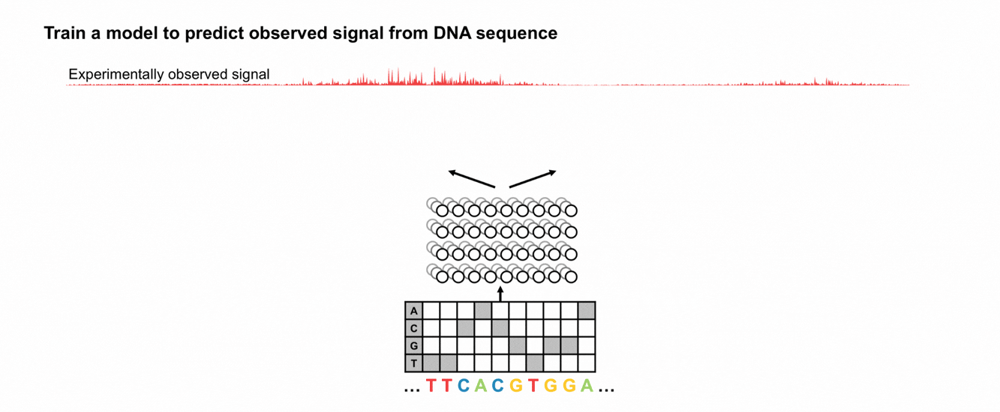
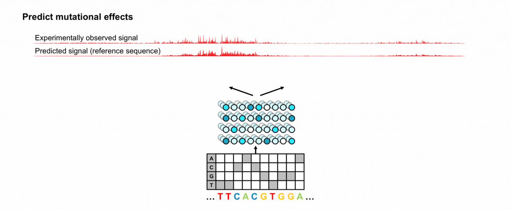
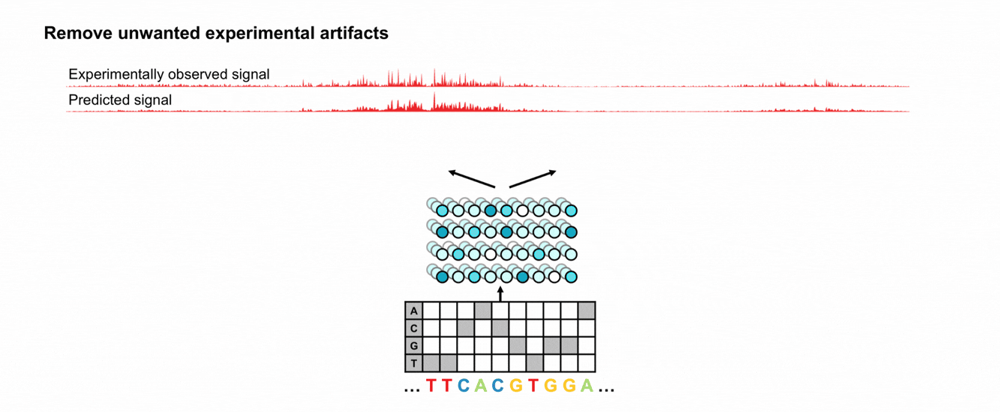
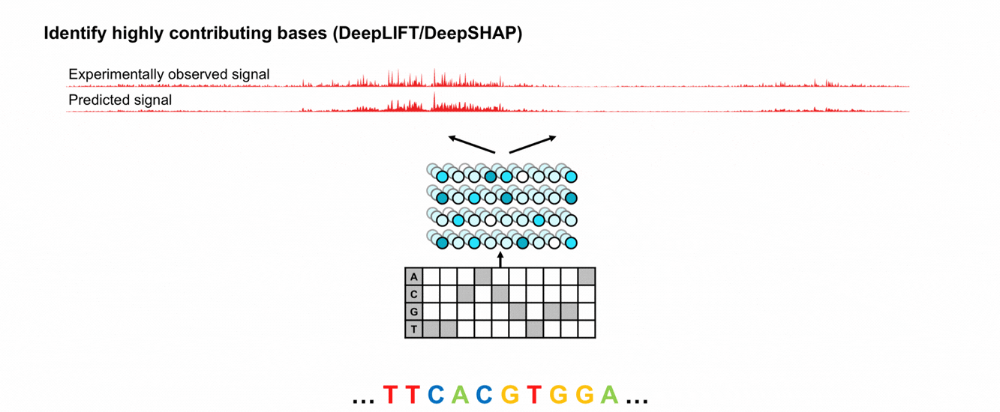
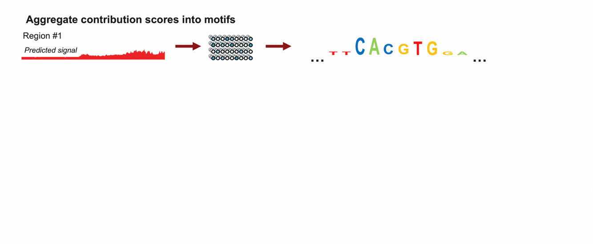
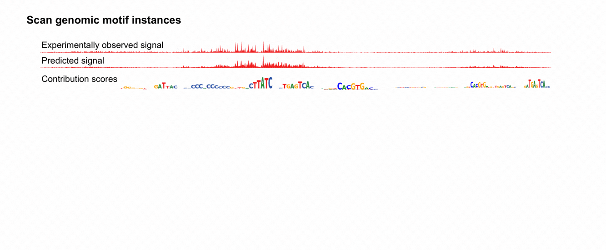
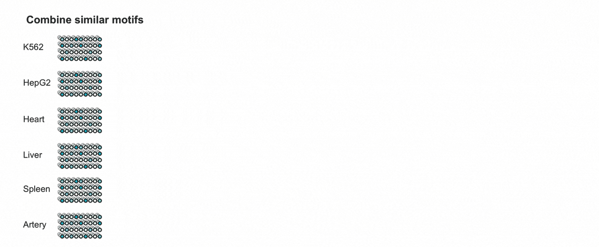
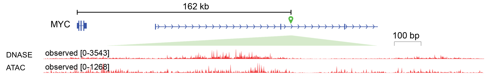
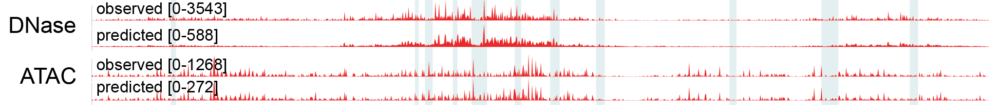


Over two decades, the Encyclopedia of DNA Elements (ENCODE) Consortium has used diverse functional genomics experiments to map millions of regions in the human and mouse genomes that help control when, where, and how strongly genes are turned on. These maps characterize the biochemical properties and activity of regulatory DNA across thousands of cell types and tissues. However, they do not fully explain how this activity is encoded in the DNA sequence itself: which individual DNA letters are important, how combinations and arrangements of letters cause a region to behave differently across cell types, or how a genetic variant might alter its activity.

To help answer these questions, we developed a family of deep learning models that use DNA sequences as inputs to predict associated genome-wide biochemical activity measured by diverse experiments. We also developed a framework of model interpretation methods, allowing us to identify the sequence features and regulatory rules that drive model predictions. 

Today, we release **GRAMMAR** (Genomic Regulatory Atlas of sequence Models, Motifs, Annotations and Rules), a collection of 3,865 experiment-specific model sets across the ENCODE data compendium spanning several layers of gene regulation, including the binding of regulatory proteins to DNA, chromatin accessibility, transcription initiation, and regulatory activity measured using high-throughput reporter assays. For each experiment, we also release model-predicted, de-noised biochemical activity profiles at single-base resolution; model-estimated contributions of individual DNA bases to the activity of each regulatory element in each cellular context; recurring predictive DNA patterns (motifs) learned by the models; the genomic locations of predictive motif instances; and genome-browser tracks that make these outputs easy to explore.

Together, these resources transform thousands of ENCODE experiments into a reusable and interpretable atlas of the cell-context-specific DNA sequence rules that shape gene regulation. In this first post of a broader series, we introduce the ENCODE GRAMMAR resource and show how predictions and sequence annotations derived from multiple models can be integrated to decode the sequence basis of regulatory element activity.

**Contributions**:
_Author order does not represent relative contribution_
- Vivek Ramalingam: BPNet model optimization and training, data uploads, general analysis
- Chang M. Yun: ChromBPNet model training, MotifCompendium analysis
- Vivian Hecht: ChromBPNet model training, model resource uploads, project management
- Aman Patel: Model resource uploads
- Anusri Pampari: ChromBPNet model development, ChromBPNet model training, data uploads
- Ziwei Chen: ReporterNet model development, ReporterNet model training, ChromBPNet model training
- Kelly Cochran: ProCapNet model development and training
- Surag Nair, Zahoor Zafrulla, Alex Tseng: BPNet refactoring
- Avanti Shrikumar, Jacob Schreiber, Alex Tseng: TF-MoDISco methods development and optimization
- Austin Wang: FiNeMo methods development
- Salil Deshpande, Chang M. Yun: MotifCompendium methods development
- Abhimanyu Banerjee, Georgi K. Marinov: Zinc finger transcription factor analysis
- Anshul Kundaje: PI, Conceptualization, Project management, Mentoring, Funding


> This is the first post in a series on dENCODE. The series will cover:
> 1. **ENCODE GRAMMAR: The ENCODE deep learning model resource for decoding the DNA sequence logic of genomic regulatory elements (this post)**
> 2. ENCODE GRAMMAR: Quickstart -Accessing and using the ENCODE GRAMMAR collection 
> 3. ENCODE GRAMMAR: Interpreting regulatory DNA with deep learning models
> 4. ENCODE GRAMMAR: The transcription factor binding GRAMMAR resource 
> 5. ENCODE GRAMMAR: The chromatin accessibility GRAMMAR resource
> 6. ENCODE GRAMMAR: Predicting the effects of noncoding genetic variants
> 7. ENCODE GRAMMAR: MotifCompendium - a unified lexicon of regulatory sequence motifs
> 8. ENCODE GRAMMAR: Contrasting regulatory sequence code across assays and cell types
> 9. ENCODE GRAMMAR: Building a production-scale model atlas in an academic setting

---
## The genome encodes a regulatory control system
The **human genome** is the complete set of instructions encoded in DNA and carried by nearly every cell in the body. It contains about 3.2 billion DNA base pairs, built from four nucleotide bases represented by the letters A, C, G, and T. Although human genomes are overwhelmingly similar, their DNA sequences differ at millions of positions across individuals. These differences, known as **genetic variants**, contribute to human diversity and can influence traits and disease risk.

The human body contains hundreds of distinct cell types—including neurons, liver cells, and immune cells—with very different morphology and functions. Yet nearly all cells within an individual contain essentially the same genome. How can the same DNA sequence produce such remarkable cellular diversity?

**Genes** are segments of DNA that contain instructions for producing **RNA** molecules, some of which are translated into proteins. The transcription of genes into RNA is tightly regulated: different genes are expressed at different levels, in different cell types, and at different times. These distinct patterns of gene expression allow cells with the same genome to acquire different identities and perform specialized functions. Precise regulation of gene expression is therefore essential for development, normal cellular function, and responses to the environment.

Much of this control is encoded in **regulatory elements**—regions of DNA, including promoters and enhancers, that help determine when, where, and how strongly genes are expressed. DNA is packaged with proteins into **chromatin**, which influences how accessible different regions of the genome are to the cellular machinery. Regulatory proteins called **transcription factors**, recognize and bind specific short DNA sequence patterns, or **motifs**, within regulatory elements and help increase or decrease gene expression by recruiting or blocking the machinery that carries out transcription. Chromatin accessibility and transcription-factor binding influence one another: exposed DNA is easier for regulatory proteins to reach, while some proteins can also open or reorganize chromatin.

Different cell types express different combinations of transcription factors and maintain different chromatin states across the genome. As a result, different cell types engage different repertoires of regulatory elements producing distinct patterns of gene expression, despite containing essentially the same genomic DNA sequence. Genetic variants within regulatory elements can alter transcription-factor binding or other regulatory activity, potentially changing gene expression in particular cellular contexts. Disruption of this regulatory system can interfere with development and cellular function and contribute to disease.

To understand how the genome encodes gene regulation, we therefore need to:
- map the genomic locations of candidate regulatory elements;
- measure their biochemical activity (e.g. transcription-factor binding and chromatin state), and associated gene expression across cell types and conditions;
- determine which DNA bases within regulatory elements are important and how their combinations and arrangements control different types of biochemical activity in different cell types; and
- determine how genetic variants alter biochemical activity in different cellular contexts.

## ENCODE: An Encyclopedia of DNA Elements across thousands of cell types
Over the past two decades, the [**Encyclopedia of DNA Elements** (**ENCODE**) Consortium](https://www.encodeproject.org/) has made major progress toward the first two goals. Using a broad range of genome-wide functional genomics experiments, ENCODE has mapped millions of candidate regulatory elements in the human and mouse genomes by characterizing their biochemical activity across diverse cell types, tissues, developmental stages, and conditions.
These experiments measure complementary layers of gene regulation, including where transcription factors bind DNA, which regions of chromatin are accessible, where transcription begins, and which genes are expressed. Together, they provide detailed maps of where regulatory activity occurs and how it differs across cellular contexts. We briefly describe some of the key experimental assays below.
**TF ChIP-seq** (transcription factor chromatin immunoprecipitation followed by sequencing) maps where a particular transcription factor binds the genome in a specific cell type. Cells are treated so that proteins remain attached to the DNA they occupy, the DNA is fragmented, and an antibody is used to isolate fragments bound by the transcription factor of interest. These fragments are sequenced on a high-throughput sequencer and mapped to the genome to identify their likely locations, which produces concentrations of reads, or **peaks**, at genomic regions enriched for binding by that TF. TF ChIP-seq peak regions are often statistically enriched for recurring short DNA sequence patterns, called motifs, that typically mediate the binding of the TF to DNA. However, each TF ChIP–seq experiment profiles only one TF in one cellular context. Systematically measuring the binding of the roughly 2,000 human TFs across all cell types and conditions would therefore be prohibitively laborious and expensive.  
 TF binds to accessible DNA; (2) DNA is broken into fragments; (3) Antibodies bind to TF-DNA complex; (4) TF-DNA complex is pulled down; (5) Isolated DNA is cleaned and sequenced; (6) Sequences accumulate around the TF binding site.")

**DNase-seq** and **ATAC-seq** experiments partly address this limitation by providing a genome-wide map of regions of accessible chromatin which are often regulatory elements occupied by combinations of transcription factors and other regulatory proteins. So a single accessibility experiment can highlight regulatory elements bound by many factors in a given cellular context, although it does not directly identify which proteins are bound. DNase–seq uses the enzyme DNase I to cut exposed DNA, whereas ATAC–seq uses the Tn5 transposase to insert sequencing adapters into accessible DNA. The resulting DNA fragments are sequenced and mapped to the genome. Regions containing many mapped fragments appear as peaks of chromatin accessibility. DNase I and Tn5 also have preferences for particular DNA sequences, so the observed signal profiles reflect both genuine chromatin accessibility and assay-specific sequence bias. Separating these components is especially important when interpreting the signal at single-base resolution. 

 DNA can wrap around histones ('closed') or remain unwound ('open'); (2) Enzymes (DNase I or Tn5 transposase) cut accessible DNA; (3) DNA fragments are sequenced; (4) Accessible regions appear as peaks.")

In addition to chromatin accessibility and transcription factor binding, gene expression is further regulated in the moments preceding transcription. **PRO-cap** allows precise mapping of transcription start sites and quantifies active transcription in a cell, by mapping the 5' end of RNA from transcriptionally engaged RNA polymerases. 
 
And **MPRAs** and related high throughput reporter assays are used to experimentally measure whether particular sequences are in fact responsible for regulating gene expression. In general, in reporter assays, a candidate Cis-Regulatory Element, or cCRE, is inserted into a short sequence which also includes a measurable reporter output, such as a fluorescent molecule, or sequence barcodes in case of the high throughput versions. The greater the level of the measured reporter, the more active the regulatory element.

ENCODE has developed a set of approximately 16,000 standardized, uniformly processed datasets for the assays described above and many others, across a wide range of cell lines, primary cells and tissues. These are organized and publicly available for download via the [ENCODE portal](https://encodeproject.org). 

[Used the assays to map ~4 million candidate cis-regulatory elements: Explain cCRE, Enhancer, Promoter.]

The consortium recently released a preprint describing the newly included datasets in the fourth and final phase of the project [ENCODE 4](https://www.biorxiv.org/content/10.64898/2026.07.06.731365v1).

. (https://doi.org/10.1038/nature14248)")
_Coverage of the ENCODE Project: hundreds of biochemical markers, performed in hundreds of cell types and tissues, measured across 3 billion genomic positions. From Roadmap Epigenomics Consortium et al. Integrative analysis of 111 reference human epigenomes. Nature 518, 317–330 (2015). ([https://doi.org/10.1038/nature14248](https://doi.org/10.1038/nature14248))_

However, while the experimental assays can help map the locations of active regulatory genomic elements, they provide limited mechanistic insights, and we are left with some fundamental questions, for example:

- *Which sequence features drive TF binding and chromatin accessibility?*
- *How do combinations and arrangements of motifs influence TF occupancy?*
- *What would happen if an individual nucleotide were altered?*
- *Is a disease-causing mutation causing its effect via changes to a transcription factor binding site?*
 
## BPNet family of deep learning models uncover the quantitative role of sequence in regulation
Our group has developed a suite of deep learning models and downstream tools to address these questions. They include:
- **BPNet:** A convolutional neural network (CNN) trained on TF-ChIP-seq that predicts the binding of a TF from DNA sequence;
- **ChromBPNet:** A CNN with a BPNet-like architecture trained on DNase- or ATAC-seq that predicts chromatin accessibility from DNA sequence and corrects for enzymatic bias;
- **ProCapNet:** A CNN with a BPNet-like architecture trained on ProCAP-seq that predicts transcription initiation from DNA sequence;
- **ReporterNet:** A CNN with a BPNet-like architecture trained on MPRA data that predicts large-scale reporter assay signal from DNA sequence.

.")
_Example BPNet-style model architecture with bias-correction: ChromBPNet. From Pampari, A. et al. ChromBPNet: bias factorized, base-resolution deep learning models of chromatin accessibility reveal cis-regulatory sequence syntax, transcription factor footprints and regulatory variants. _bioRxiv_ 2024.12.25.630221 (2024). ([https://doi.org/10.1101/2024.12.25.630221](https://doi.org/10.1101/2024.12.25.630221))_

We describe the basic steps of our workflow below, with more detailed explanations available in the manuscripts [ChromBPNet](https://doi.org/10.1101/2024.12.25.630221), [BPNet](https://doi.org/10.1038/s41588-021-00782-6), [ProCapNet](https://doi.org/10.1101/2024.05.28.596138).

**(1) Training:** We begin by training a deep learning model to reconstruct the observed experimental signal when provided the DNA sequence of the region. This mimics the underlying regulatory biology: for a given region of DNA, sequence-specific proteins in the nucleus influence the DNA to be in some regulatory state (e.g., bound by a transcription factor) based on its sequence, which is captured by the experiment (e.g., TF ChIP-seq signal). For a model to successfully reconstruct the experimental signal, we expect that the model should do so by learning the same sequence-specific rules of the nuclear environment. We evaluate the model performance by observing its reconstruction in held out chromosomes unseen during training.

**(2) Prediction:** Once the model is successfully trained to predict unseen sequences, its immediate use is to predict the effect of potentially disease-causing mutations in the genome. We can introduce mutations at any genomic sequence and predict the log-fold change in signal, which can be related to the effect size of the variant.

**(3) De-bias:** Another ability of the trained model is to remove unwanted experimental artifacts. DNase-seq and ATAC-seq can suffer from unwanted artifacts, due to the sequence preference of the enzyme (DNase I and Tn5 transposase) to cut at specific sequence positions. We train a separate model to predict only the effects of the experimental artifact, and subtract its effect to isolate only the regulatory signal.

**(4) Sequence contributions:** Next, to understand what the model has learned, we identify and quantify sequences that were important for the model to make its predictions, by tracking the relative activations inside the model during prediction and aggregate them per position, using interpretation methods such as [DeepLIFT/DeepSHAP](https://doi.org/10.48550/arXiv.1704.02685). The most important positions and bases can often be attributed to the binding sequence preference of known transcription factors.   

**(5) Aggregate elements into motifs:** To identify what type of highly contributing sequence patterns were learned by the model and are commonly observed in the genome, we sample highly contributing sequences across the genome, and aggregate them into distinct sequence patterns (“motifs”), using motif discovery algorithms such as [TF-MoDISco](https://doi.org/10.48550/arXiv.1811.00416). The sequence motifs can, again, often be mapped to the binding preference of known transcription factors, that then help identify the main transcription factors involved in driving the particular experimental signal.

**(6) Identify all genomic motif instances:** To identify every genomic instance of the newly discovered sequence motifs, we take the motifs and scan them across the sequence contribution score of the entire genome, using motif scanning algorithms such as [FiNeMo](https://github.com/kundajelab/Fi-NeMo). This can help annotate the transcription factors responsible for each highly contributing sequence.

**(7) Combine motifs across models:** Lastly, to combine motifs learned across multiple models into a single, non-redundant set, we aggregate similar motifs using motif clustering algorithms such as [MotifCompendium](https://zenodo.org/doi/10.5281/zenodo.17123347). At scale, this helps identify all motifs involved in different modes of regulation (e.g., all chromatin accessibility-related motifs).

In the following section, we share an example in the MYC locus to showcase the power of the models:

## Case study: Regulation in the MYC locus through the lens of deep learning models
The Myc family of proteins is a set of transcription factors that play an important role in cell proliferation, and mutations in the MYC gene have been shown to lead to many different cancer phenotypes. Thus, understanding the mechanisms of regulation at the MYC locus at base-pair resolution can be crucial to help answer key questions relating to disease biology, Below, we view a CRISPRi-validated distal enhancer in the MYC locus [chr8:127,898,412—127,899,647] through the lens of 15 different models.

First, we examine chromatin accessibility of the MYC enhancer in K562 through two assays: DNase-seq and ATAC-seq. Using the signal profile from each experiment, we train a separate ChromBPNet model for each assay: one for DNase-seq and another for ATAC-seq. We then use each model to reconstruct their corresponding observed experimental profiles to assess model performance. Below, we see that the models recapitulate the experimental profiles with strong concordance. 

Second, we use the models to remove any experimental artifacts from the assay profile, and isolate only the true underlying biological signal. Prior to removal, despite both DNase-seq and ATAC-seq aiming to capture the same accessibility signal, their profiles look highly different due to artifact effects, such as enzyme bias differences (DNase I vs. Tn5 transposase). Using the ChromBPNet models trained on each assay (that never observes any profiles from the other assay), we can remove the artifact effects and show only the underlying accessibility signal. Then, comparing the two de-biased profiles, we see that the models successfully reconcile the two orthogonal assays into agreement.

 
Third, using the models, we highlight the key sequences that the models used to make their predictions, and begin to observe the underlying biological mechanism of regulation at this enhancer. Examining the highly contributing sequences that each ChromBPNet model used, we observe that the following transcription factors are strongly involved in accessibility of the locus in K562: GATA, AP1, SP, ETV/ETS, CEBP.

.")

Lastly, to orthogonally validate the transcription factors involved, we examine the highly contributing sequences for a different assay, TF ChIP-seq, used by a different model, BPNet. Despite being trained on an entirely orthogonal assay type (TF ChIP-seq vs. DNase-seq/ATAC-seq), we observe that the same sequences are used to predict TF binding as were used to predict chromatin accessibility.

.")

To dynamically examine the locus, we provide below an interactive browser session of the exact locus and models:

 

## GRAMMAR: An 'Encyclopedia' of regulatory DNA deep learning sequence models
As part of ENCODE, we trained these models on hundreds of cell and tissue types available through the ENCODE consortium. We trained [BPNet](https://doi.org/10.1038/s41588-021-00782-6) models on 2,339 TF-ChIP-seq across 788 TFs, [ChromBPNet](https://doi.org/10.1101/2024.12.25.630221) models on 1,512 DNase-seq and ATAC-seq across 408 biosamples, [ProCapNet](https://doi.org/10.1101/2024.05.28.596138) models on 6 PRO-Cap, and ReporterNet models on 8 MPRAs to capture the dynamic regulatory activity across diverse samples. We release them together with the fourth and final phase of the ENCODE Project.
 
Through the power of the models and the richness of the ENCODE dataset, we hope to empower the community at large to explore important questions relating to the fundamental biology of gene regulation and mechanisms of disease in a wide variety of tissues and cell types. 

## How can I use the resource?
As part of the ENCODE Project, all data, models, analysis are available at the [Project portal](https://www.encodeproject.org/). If you use our models, please cite the [ENCODE preprint](https://doi.org/10.64898/2026.07.06.731365). 

Beyond the ENCODE portal, we provide several user-friendly alternatives for accessing and visualizing our data: 
- **Models**: We have uploaded the models for open access on the [ENCODE Portal](https://www.encodeproject.org/{ADD}) and on [**Hugging Face**](https://huggingface.co/collections/kundajelab/encode-bpnet-models)
- **Predictions**: We have created browser-friendly tracks of all model predictions in experimental peaks, as a [**UCSC Track Hub**](https://genome.ucsc.edu/cgi-bin/hgTracks?db=hg38&hubUrl=https://kundajelab.github.io/ucsc-trackhub-encode.github.io/hub.txt) for easy, interactive browser sessions
- **Sequence annotations**: We have identified highly contributing bases for all models and annotated the likely corresponding TF, as a [**UCSC Track Hub**](https://genome.ucsc.edu/cgi-bin/hgTracks?db=hg38&hubUrl=https://kundajelab.github.io/ucsc-trackhub-encode.github.io/hub.txt) for easy, interactive browser sessions
- **User guide**: We are currently building an _interactive_ user guide to help the community navigate and explain the resource (_work in progress_)
- **Preprint**: For more detail, the latest ENCODE preprint is out on [_bioRxiv_](https://doi.org/10.64898/2026.07.06.731365)
 
We still have so much to share about the resource! We are planning to regularly share the many different ways you can use the resource (~every week) for the foreseeable future, so give us a follow and be on the lookout for more.

## References
1. The ENCODE Project Consortium et al. The Encyclopedia of DNA Elements. _bioRxiv_ 2026.07.06.731365 (2026) ([https://doi.org/10.64898/2026.07.06.731365](https://doi.org/10.64898/2026.07.06.731365))
2. Avsec, Ž. et al. Base-resolution models of transcription-factor binding reveal soft motif syntax. _Nat Genet_ 53, 354—366 (2021). ([https://doi.org/10.1038/s41588-021-00782-6](https://doi.org/10.1038/s41588-021-00782-6))
3. Pampari, A. et al. ChromBPNet: bias factorized, base-resolution deep learning models of chromatin accessibility reveal cis-regulatory sequence syntax, transcription factor footprints and regulatory variants. _bioRxiv_ 2024.12.25.630221 (2024). ([https://doi.org/10.1101/2024.12.25.630221](https://doi.org/10.1101/2024.12.25.630221))
4. Cochran, K. et al. Dissecting the cis-regulatory syntax of transcription initiation with deep learning. _bioRxiv_ 2024.05.28.596138 (2024). ([https://doi.org/10.1101/2024.05.28.596138](https://doi.org/10.1101/2024.05.28.596138))
5. Yun, C. M. et al. A unified lexicon of predictive DNA sequence motifs from ENCODE transcription factor binding and chromatin accessibility assays. (2025) doi:10.5281/zenodo.17179111. ([https://doi.org/10.5281/zenodo.17179111](https://doi.org/10.5281/zenodo.17179111))
