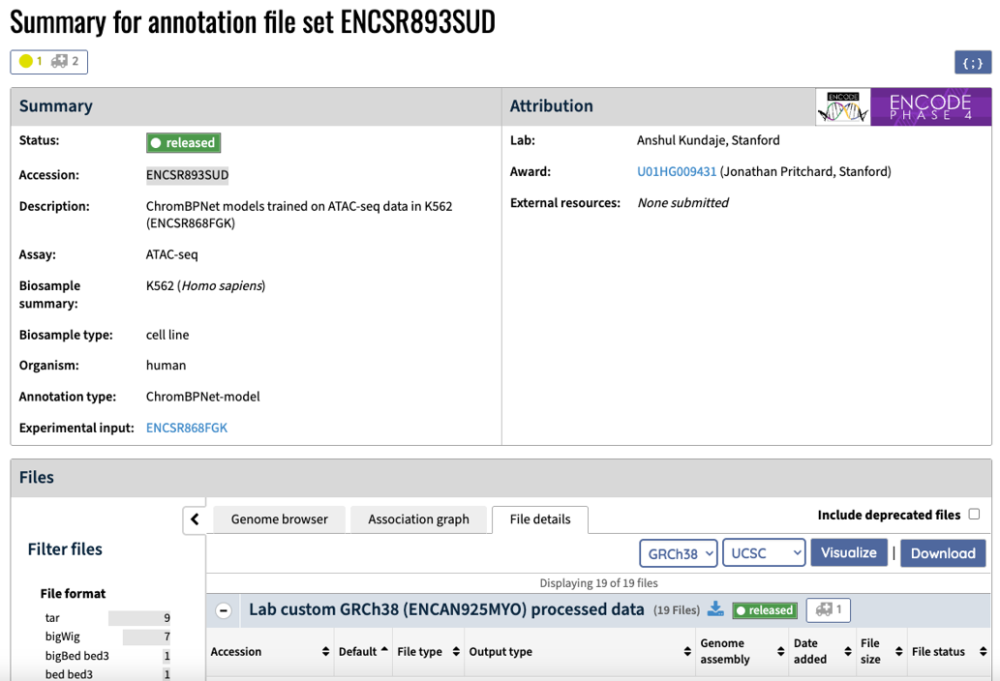
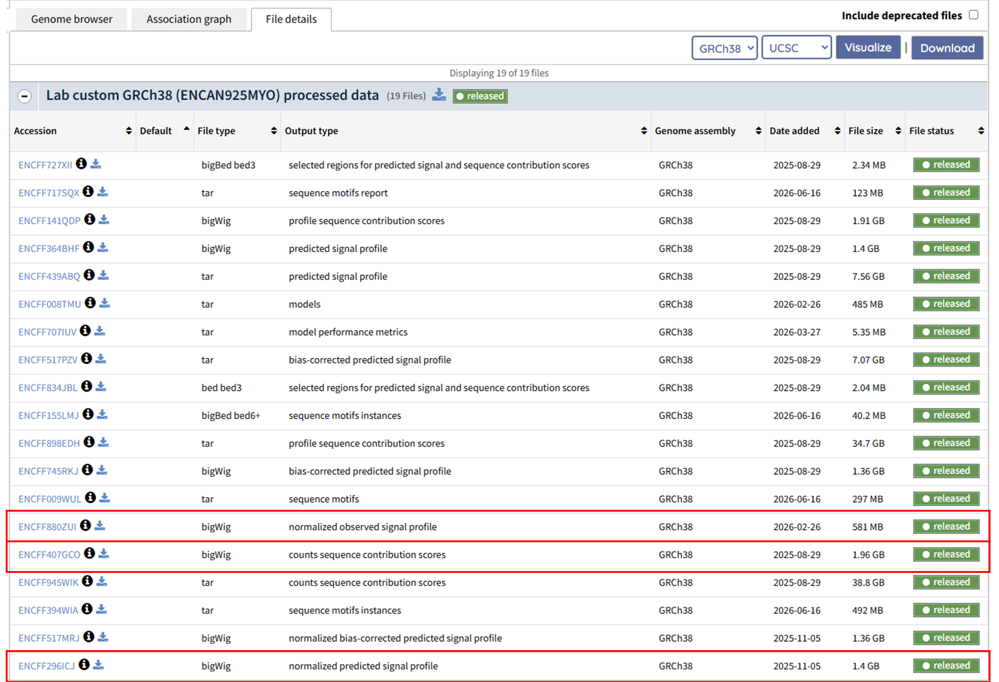
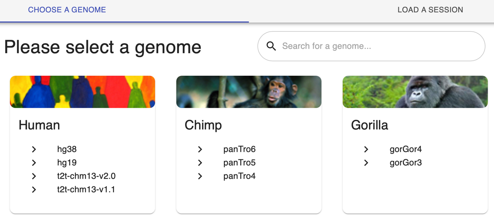
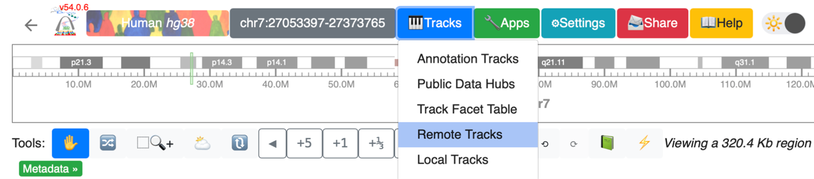
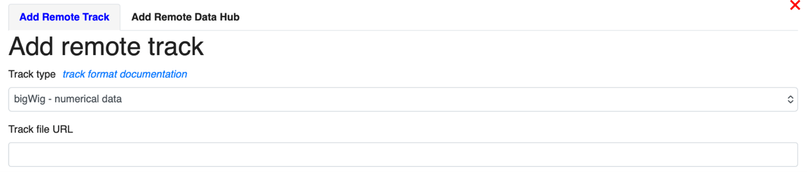
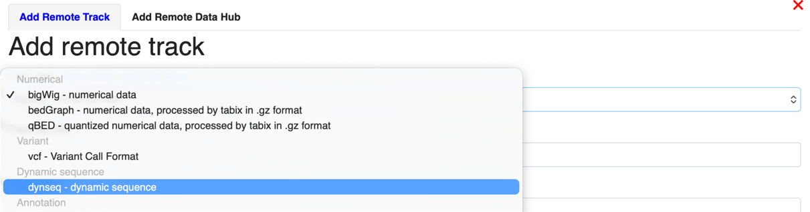
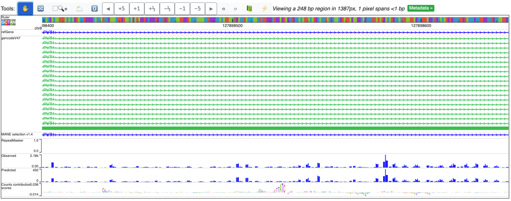


**ENCODE GRAMMAR** (Genomic Regulatory Atlas of sequence Models, Motifs, Annotations and Rules) is a collection of 3,865 experiment-specific deep learning model sets and derived sequence annotations that connect the ENCODE project's human gene regulation maps from extensive biochemical profiling experiments to the underlying DNA sequence features that drive regulatory activity. 

This five-minute **quickstart guide** shows how to find an ENCODE GRAMMAR model-set and its associated annotation and load its most commonly used outputs into an interactive genome browser. By following the steps below, you will create a browser session displaying an experimentally observed regulatory profile, the corresponding model-predicted profile, and a base-resolution sequence-contribution map.

**Contributions**: _(Author order does not represent relative contribution)_
- Vivekanandan Ramalingam1 (vir@stanford.edu): BPNet model optimization and training, data uploads, general analysis
- Chang M. Yun1 (chang.m.yun@stanford.edu): ChromBPNet model training, MotifCompendium analysis
- Vivian Hecht1 (vhecht@stanford.edu): ChromBPNet model training, model resource uploads, project management
- Aman Patel1 (patelas@stanford.edu): Model resource uploads
- Anusri Pampari1 (anusri@stanford.edu): ChromBPNet model development, ChromBPNet model training, data uploads
- Ziwei Chen1 (ziwei75@stanford.edu): ReporterNet model development, ReporterNet model training, ChromBPNet model training
- Kelly Cochran1 (kcochran@stanford.edu): ProCapNet model development and training
- Adam He1 (ayhe@stanford.edu): ProCapNet user guide
- Surag Nair1 (surag@stanford.edu), Zahoor Zafrulla1 (zahoor@stanford.edu), Alex Tseng1 (amtseng@stanford.edu): BPNet refactoring
- Avanti Shrikumar1 (avanti@stanford.edu), Jacob Schreiber1 (jmschr@stanford.edu), Alex Tseng1 (amtseng@stanford.edu): TF-MoDISco methods development and optimization
- Austin Wang1 (atwang@stanford.edu): FiNeMo methods development
- Salil Deshpande1 (salil512@stanford.edu), Chang M. Yun1 (chang.m.yun@stanford.edu): MotifCompendium methods development
- Abhimanyu Banerjee1 (manyu@stanford.edu), Georgi K. Marinov1 (marinovg@stanford.edu): Zinc finger transcription factor analysis
- Chang M. Yun1 (chang.m.yun@stanford.edu), Vivian Hecht1 (vhecht@stanford.edu), Vivekanandan Ramalingam1 (vir@stanford.edu): Blog posts
- Anshul Kundaje1* (akundaje@stanford.edu): PI, Conceptualization, Project management, Mentoring, Funding

_1Stanford University, *Correspondence._



---
> This is the second post in a series on **ENCODE GRAMMAR**. The series will cover:
> 1. [ENCODE GRAMMAR: The ENCODE deep learning model resource for decoding the DNA sequence logic of genomic regulatory elements](../2026-012/)
> 1. **Accessing and using the ENCODE GRAMMAR collection: A quickstart guide (this post)**
> 1. Interpreting regulatory DNA with deep learning models
> 1. The transcription factor binding GRAMMAR resource
> 1. The chromatin accessibility GRAMMAR resource
> 1. Predicting the effects of noncoding genetic variants
> 1. MotifCompendium - a unified lexicon of regulatory sequence motifs
> 1. Contrasting regulatory sequence codes across assays and cell types
> 1. Building a production-scale model atlas in an academic setting

## Quick-start guide (5 min)
ENCODE GRAMMAR transforms individual ENCODE experiments into experiment-specific BPNet-family model sets together with predicted regulatory profiles, sequence-contribution maps, predictive motifs, motif instances, and variant-effect predictions. Readers who are new to the resource may wish to begin with the [**ENCODE GRAMMAR overview**](../2026-012/), which explains the biological motivation, model families, interpretation workflow, and complete collection of released products.

Below, we explain how to navigate an ENCODE GRAMMAR model-set annotation page and load several commonly used model outputs into the WashU Epigenome Browser. Visualizing these tracks is a useful first step before designing larger-scale quantitative analyses.

We use the example of a **ChromBPNet model set generated from an ATAC-seq experiment in K562 cells (ENCSR893SUD)**.

### Step 1: Find the model-set annotation page

Open the ChromBPNet model-set annotation for K562 ATAC-seq: [https://www.encodeproject.org/annotations/ENCSR893SUD/](https://www.encodeproject.org/annotations/ENCSR893SUD/).

Model-set annotations associated with an experiment can also be found from the corresponding experiment summary page.

A searchable list of all ENCODE annotations is available at [https://www.encodeproject.org/annotations/](https://www.encodeproject.org/annotations/).

### Step 2: Find the files of interest

Scroll to the middle of the annotation page and select the **File details** tab to browse the available files.

For an initial exploration of a ChromBPNet model set, we recommend viewing three complementary tracks:

1. the **normalized observed signal profile**, representing the experimentally measured chromatin-accessibility profile;
2. the **normalized predicted signal profile**, representing the regulatory profile predicted by ChromBPNet from DNA sequence; and
3. the **counts sequence-contribution scores**, estimating how much each DNA base contributes to the model's prediction of total accessibility.

The following steps require the URLs of these bigWig files. Right-click the **download icon** beside a file and select **Copy link address**. The links for this example are provided here:

- **Normalized observed signal profile**: [https://www.encodeproject.org/files/ENCFF880ZUI/@@download/ENCFF880ZUI.bigWig](https://www.encodeproject.org/files/ENCFF880ZUI/@@download/ENCFF880ZUI.bigWig)
- **Normalized predicted signal profile**: [https://www.encodeproject.org/files/ENCFF296ICJ/@@download/ENCFF296ICJ.bigWig](https://www.encodeproject.org/files/ENCFF296ICJ/@@download/ENCFF296ICJ.bigWig)
- **Counts sequence contribution scores**: [https://www.encodeproject.org/files/ENCFF407GCO/@@download/ENCFF407GCO.bigWig](https://www.encodeproject.org/files/ENCFF407GCO/@@download/ENCFF407GCO.bigWig)

This quickstart focuses on these three tracks. Additional ENCODE GRAMMAR products, including predictive motif-instance annotations, can be accessed through the ENCODE Portal and the UCSC Track Hub linked below.

For descriptions of the complete collection of files and model-derived products, see the [**ENCODE GRAMMAR overview**](../2026-012/) and the [**ENCODE 4 preprint**](https://doi.org/10.64898/2026.07.06.731365).

### Step 3: Load the bigwigs into the WashU genome browser

Navigate to the [WashU Epigenome Browser](https://epigenomegateway.wustl.edu/browser2022/). On the home page, find the **Human** section and select **hg38** to open a new browser session.

In the new browser session, select the **Tracks** icon at the top of the page and then choose **Remote Tracks** from the dropdown menu.

A window for adding remote tracks will appear:

First, add the **normalized observed signal profile** and **normalized predicted signal profile**:

1. Copy and paste the first URL from Step 2.
2. Add an informative label, such as `Observed accessibility`.
3. Click **Submit**.
4. Click **Add another track** and repeat the process for the predicted profile, using a label such as `ChromBPNet predicted accessibility`.

For the third bigWig—the counts sequence-contribution scores—change the track type to **Dynseq**. Select the **Track type** menu and choose **Dynseq (dynamic sequence)** from the list.

Dynseq displays each nucleotide as a letter whose height and direction reflect its contribution score. Positive scores indicate bases that increase the model prediction relative to the reference, whereas negative scores indicate bases that decrease it. The nucleotide letters appear only after zooming in sufficiently. Clusters of bases with large contribution scores often correspond to predictive regulatory sequence features, including transcription-factor motif instances.

Add an informative label, such as `Counts sequence-contribution map`, and submit the track.

The completed browser session should resemble the example below, with the experimentally observed profile, model-predicted profile, and sequence-contribution map aligned at the same genomic locus:

For more information about configuring tracks, navigating loci, and sharing sessions, see the [WashU Epigenome Browser documentation](https://epigenomegateway.readthedocs.io/en/latest/usage.html).

## How else can I use the resources?
All ENCODE data, model sets, and model-derived sequence annotations are openly available through the [**ENCODE Portal**](https://www.encodeproject.org/search/?type=Annotation&annotation_type=BPNet-model&annotation_type=ChromBPNet-model&status=released). The complete ENCODE GRAMMAR resource contains 3,865 experiment-specific model sets spanning TF binding, chromatin accessibility, transcription initiation, and high-throughput reporter activity.

Additional access points include:

- **Model-sets and sequence annotations:** Browse released [BPNet model sets](https://www.encodeproject.org/search/?searchTerm=BPNet&type=Annotation&annotation_type=BPNet-model&status=released&assay_term_name=ChIP-seq), [ChromBPNet model sets](https://www.encodeproject.org/search/?searchTerm=ChromBPNet&type=Annotation&annotation_type=ChromBPNet-model&organism.scientific_name=Homo+sapiens&status=released), [ProCapNet model sets](https://www.encodeproject.org/search/?searchTerm=ProCapNet&type=Annotation), and [ReporterNet model sets](https://www.encodeproject.org/search/?searchTerm=ReporterNet&type=Annotation&status=released) on the ENCODE Portal.
- **HuggingFace model zoo:** Download ENCODE GRAMMAR models from [**Hugging Face**](https://huggingface.co/collections/kundajelab/encode-bpnet-models).
- **Predictions and sequence annotations:** Explore model predictions, sequence-contribution maps, and predictive motif instances through the [**UCSC Track Hub**](https://genome.ucsc.edu/cgi-bin/hgTracks?db=hg38&hubUrl=https://kundajelab.github.io/ucsc-trackhub-encode.github.io/hub.txt).
- **Unified motif lexicon:** Access the [**ENCODE Motif Compendium**](https://www.encodeproject.org/annotations/ENCSR091GRD/), which organizes related predictive motifs discovered across all ENCODE GRAMMAR models.
- **Software:** Train and interpret new models using the open-source [BPNet](https://github.com/kundajelab/bpnet/), [ChromBPNet](https://github.com/kundajelab/chrombpnet/), and [ProCapNet](https://github.com/kundajelab/ProCapNet/) repositories.
- **User guide:** We are developing an _interactive_ guide to help users navigate and interpret the resource (_work in progress_).
- **Overview and publications:** Read the [ENCODE GRAMMAR overview](../2026-012/), [ENCODE 4 preprint](https://doi.org/10.64898/2026.07.06.731365), the [BPNet paper](https://doi.org/10.1038/s41588-021-00782-6), [ChromBPNet preprint](https://doi.org/10.1101/2024.12.25.630221) and [ProCapNet preprint](https://doi.org/10.1101/2024.05.28.596138) for additional detail.

This quickstart covers only one way to explore the resource. Future (weekly) posts in this series will describe how to interpret sequence-contribution maps, compare predictive motifs across cellular contexts, and use the models to estimate the molecular effects of noncoding genetic variants.

## References
1. The ENCODE Project Consortium et al. The Encyclopedia of DNA Elements. _bioRxiv_ 2026.07.06.731365 (2026) ([https://doi.org/10.64898/2026.07.06.731365](https://doi.org/10.64898/2026.07.06.731365))
1. Yun, C. M. et al. A unified lexicon of predictive DNA sequence motifs from ENCODE transcription factor binding and chromatin accessibility assays. (2025) doi:10.5281/zenodo.17179111. ([https://doi.org/10.5281/zenodo.17179111](https://doi.org/10.5281/zenodo.17179111))
1. Avsec, Ž. et al. Base-resolution models of transcription-factor binding reveal soft motif syntax. _Nat Genet_ 53, 354—366 (2021). ([https://doi.org/10.1038/s41588-021-00782-6](https://doi.org/10.1038/s41588-021-00782-6))
1. Pampari, A. et al. ChromBPNet: bias factorized, base-resolution deep learning models of chromatin accessibility reveal cis-regulatory sequence syntax, transcription factor footprints and regulatory variants. _bioRxiv_ 2024.12.25.630221 (2024). ([https://doi.org/10.1101/2024.12.25.630221](https://doi.org/10.1101/2024.12.25.630221))
1. Cochran, K. et al. Dissecting the cis-regulatory syntax of transcription initiation with deep learning. _bioRxiv_ 2024.05.28.596138 (2024). ([https://doi.org/10.1101/2024.05.28.596138](https://doi.org/10.1101/2024.05.28.596138))
1. Shrikumar, A., Greenside, P. & Kundaje, A. Learning Important Features Through Propagating Activation Differences. _arXIV_ (2019).([https://doi.org/10.48550/arXiv.1704.02685](https://doi.org/10.48550/arXiv.1704.02685))
1. Lundberg, S. M. & Lee, S.-I. A unified approach to interpreting model predictions. in _Proceedings of the 31st International Conference on Neural Information Processing Systems_ 4768–4777 (Curran Associates Inc., Red Hook, NY, USA, 2017). ([https://dl.acm.org/doi/10.5555/3295222.3295230](https://dl.acm.org/doi/10.5555/3295222.3295230))
1. Shrikumar, A. et al. Technical Note on Transcription Factor Motif Discovery from Importance Scores (TF-MoDISco) version 0.5.6.5. _arXiv_  (2020) ([https://doi.org/10.48550/arXiv.1811.00416](https://doi.org/10.48550/arXiv.1811.00416)).
